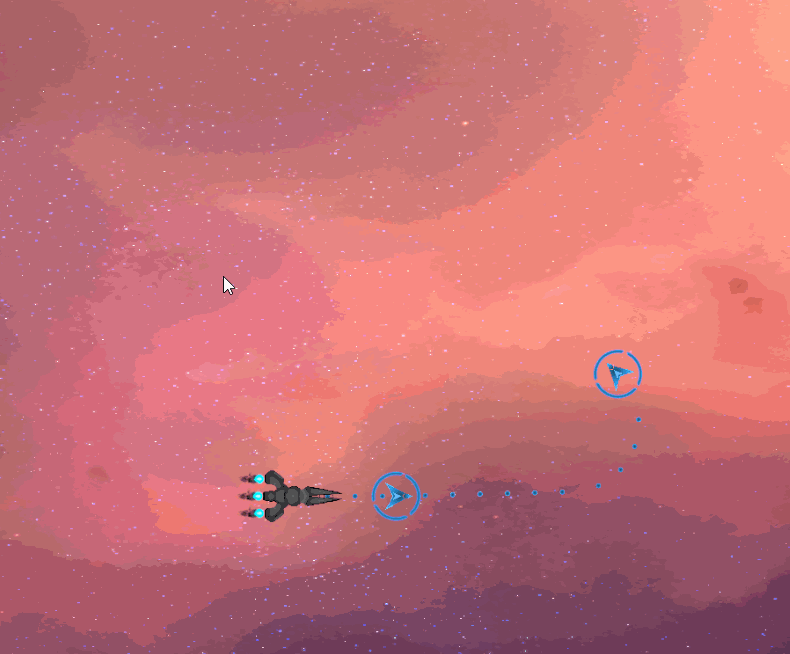
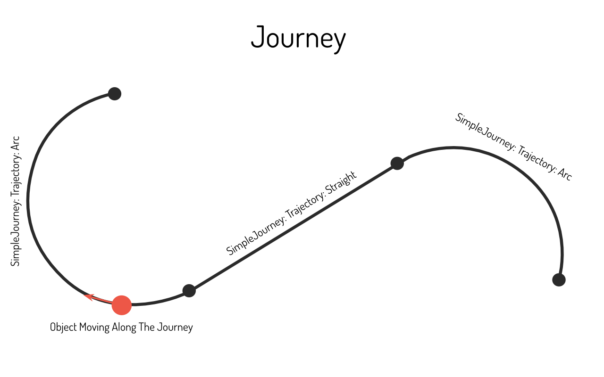
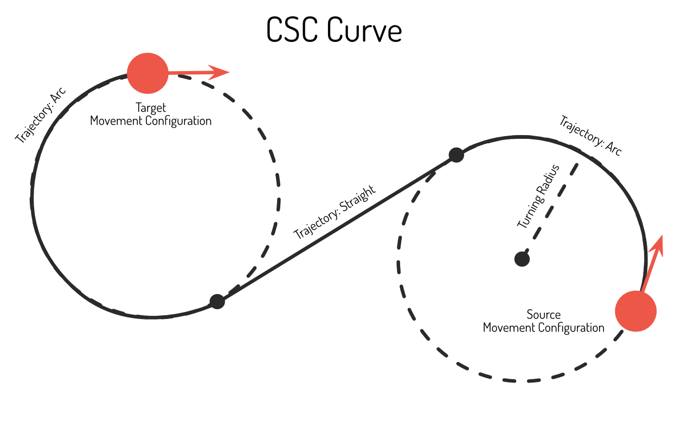
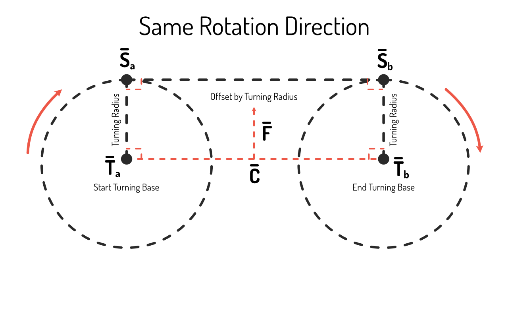
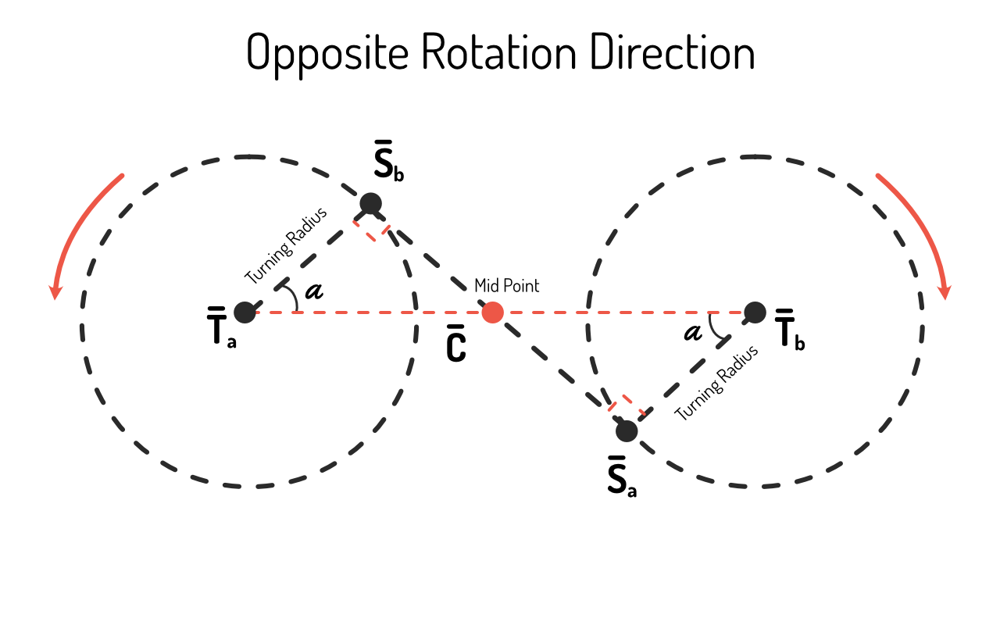
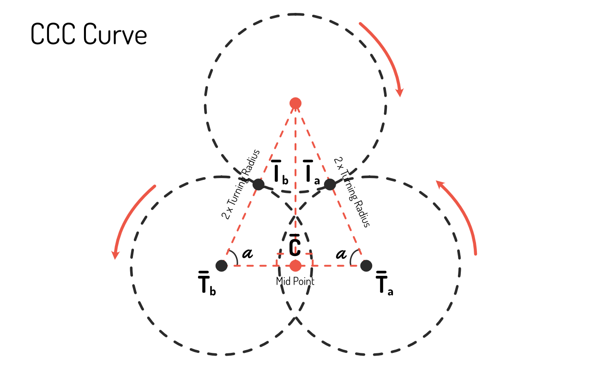

# Amber Computational Geometry
This is a computational geometry library which is planned to be used with Unity or Unreal Engine. The repositories which can be added as a submodule into Unity or Unreal project can be seen as submodules in this project. Unity package and Unreal Engine plug in setups are still to be done.

This documentation is intended as a supporting document in addition to the comments in the code. This documentation presents high level over view of the librarys functionalities and provides details on the used mathematics.

## Usage



There are many ways to use the motion planning currently implemented this library and the other geometry utility functions. In the GIF above JourneyPlanner is used for navigation. Here is an example on the code usage in `C#` the `C++` version works similarly:
```
using AmberScience.MotionPlanning;

...

// Define source and target movement configurations or get these values from the components attached to game objects.
var source = new MovementConfiguration(sourcePosition, sourceHeading);
var target = new MovementConfiguration(targetPosition, targetHeading);

// Define movement constraints.
var constraints = new MovementConstraints(turningRadious);

// Plan a journey. This needs to be done only when the source or target is changed.
var journey = JourneyPlanner.Plan(source, target);

...

// Move and object along the journey by getting and applying new movement configuration.
var nextMovementConfiguration = journey.Advance(speed * Time.deltaTime);
...
```

## Namespace: Base Math
This namespace contains base mathematics queries and presentations.

## Module: Trigonometry
The trigonometry module provides higher level functions based on trigonometry which can be used as part of more complex computations.

### Submodule: Unit Circle
The Unit Circle submodule provides functions for dealing with angles and directions of vectors using the unit circle from trigonometry. 

## Module: Geometry
This module provides classes and higher level functions for dealing with geometrical shapes using analytical geometry.

### Submodule: Class Presentations
Currently only a class for circle is provided but more will be added as needed.

### Submodule: Geometry Queries
Geometry queries submodule provides highlevel functions which depend on the geometrical shapes.

### Submodule: Geometry Rendering
This submodule provides functions to get verticies for rendering geometrical shapes.

## Module: Vectors
This module provides higher level functions for working with vectors.

### Submodule: Vector Location Queries
This submodule provides functions to get information on vectos location and orientation.

### Submodule: Vector Transformations
This submodule provides functions for transforming vectors.

# Namespace: Motion Planning
The motion planning algorithms find a sequence of movement configurations to move an object from source to target configuration. Currently this library only supports Dubins Path for movement planning on a 2D plane but the plan is to add support for other algorithms and other constraints with obstacles supported.

## Movement Configuration
Movement Configuration describes the parameters relevant for the objects current movement state. In this library at the moment there are only two:
* Position
* Heading

In the future more parameters might get added to support more complex scenarios.

The library provides components which can be attached to GameObjects or Actors to get or set current movement configuration.

## Movement Constraints
Movement Constraints describes parameters for the objects movement. In this library at the moment there is only one:
* Turning Radius: which is the min radious of a circle around which the object can turn around.

There is definitely a plan to add support for more such as:
* acceleration
* object shape
* others

## Trajectories and Journeys
Trajectories are continuous sequences of movement which can be described by a simple mathematical equation. Currently there are two types of trajectories supported.
* Arc: Moving along a circle with start and end points on the circles perimiter.
* Straight: Moving along a straight.

Trajectories don't have a concept if or where an object is moving along the trajectory. In order to move an object along a trajectory a Journey has to be created. Journey starts at start of the trajectory and can be advanced along it until it reaches the end. The SimpleJourney can be used to travel along a single trajectory and multiple SimpleJourneys can be combined into a Journey which can have multiple SimpleJourneys to present a more complex scenario.



## Planners
This section contains calculations needed to understand the algorithms in the `JourneyPlanner` module.

### Dubins path
For point like objects for which the movement is constrained by the turning rate and can only move forward Dubins path theorem can be used to find a sequence of movement configurations from source to target.

The source and target in this case are pairs of position and heading. The Dubins path theorem states that the shortest way to move an object which can only move forward and has a restricted turning rate is has one of the following structures, where R stands for turning right, L for turning left and S for going straight:
* RSR
* RSL
* LSR
* LSL
* RLR
* LRL

These can be categorized in the following two categories, where C stands for curve either left or right and S stands for going straight.
* CSC
* CCC

#### Calculating CSC Paths
Next image displays a general CSC path. Not in a CSC path case it is also possible that the length of the straight is zero and in this case in essence it is a CC path but it can be calculated in the same way just by setting length of the straight to zero.



There are four different CSC paths to consider:
* RSR
* RSL
* LSR
* LSL

For a CSC path the connection points between the straight and the arcs are the points where the tangent of the arc is equal to the the slope of the straight. The rotation direction has to be also taken into account so that when connecting to the next arc the rotation direction is correct. There two different cases to consider in this case.
* Rotation direction of the arcs is same.
* Rotation direction of the arcs is opposite.

Next the case for finding the straight between the arcs with same rotation direction is presented.



The following variables are known:
* $\vec{T_a}$ : Turning base center for the start arc.
* $\vec{T_b}$ : Turning base center for the end arc.
* The $TurningBaseRadius$.

The goal is to find:
* $\vec{S_a}$ the start of the straight connecting the turning bases.
* $\vec{S_b}$ the end of the straight connecting the turning bases.

At both $\vec{S_a}$ and $\vec{S_b}$ the slope of the straight has to match the tangent of the arcs.

Lets define vector $\vec{C} = \vec{T_b} - \vec{T_a}$ so from start to end turning base center. Lets define another vector $\vec{F}$ which is perpendicular to the $\vec{C}$ and is normalized. There are two such vectors but the correct one can be chosen based on the rotation direction.

Now:
* $\vec{S_a} = \vec{T_a} + TurningBaseRadius \cdot \vec{F}$
* $\vec{S_b} = \vec{T_b} + TurningBaseRadius \cdot \vec{F}$

Next the case for finding the straight between the arcs with opposite rotation direction is presented.



The following variables are known:
* $\vec{T_a}$ : Turning base center for the start arc.
* $\vec{T_b}$ : Turning base center for the end arc.
* The $TurningBaseRadius$.

The goal is to find:
* $\vec{S_a}$ the start of the straight connecting the turning bases.
* $\vec{S_b}$ the end of the straight connecting the turning bases.

At both $\vec{S_a}$ and $\vec{S_b}$ the slope of the straight has to match the tangent of the arcs.

Lets define vector $\vec{C} = \vec{T_b} - \vec{T_a}$ so from start to end turning base center. Lets form right angle triangles through the mid point between the turning bases, $\vec{S_a}$, $\vec{S_b}$, $\vec{T_a}$ and $\vec{T_b}$ (see image). Now the the angle between $\vec{C}$ and $\vec{S_a}$ or $\vec{S_b}$ is:

$\alpha = arccos(\frac{TurningBaseRadius}{0.5 \cdot |\vec{C}|})$

The rotation direction counter clock wise or clock wise can be determined from the rotation direction.

Now with normalizing vector $\vec{C_n} = \frac{\vec{C}}{|\vec{C}|}$ and using the Rotate vector method from `VectorTransformations`:
* $\vec{S_a} = \vec{T_a} + Rotate(TurningBaseRadius \cdot \vec{C_n}, RotationDirection \cdot \alpha)$
* $\vec{S_b} = \vec{T_b} + Rotate(TurningBaseRadius \cdot \vec{C_n}, RotationDirection \cdot \alpha)$

With these two cases it is possible to calculate the points where the arc and straight trajectories meet. From there the alternate journeys can be constructured and the shortest option can be selected as the solution.

#### Calculating CCC Paths
CCC path can be shortest only in case the points are within four $TurningRadius$ distance from one another. For CCC Paths there are two options:
* RLR
* LRL



The following variables are known:
* $\vec{T_a}$ : Turning base center for the start arc.
* $\vec{T_b}$ : Turning base center for the end arc.
* The $TurningBaseRadius$.

The goal is to find:
* $\vec{I_a}$ the intersection point of the start arc and the middle turning base.
* $\vec{I_b}$ the intersection point of the end arc and the middle turning base.

Since the middle circle and the start/end turning base are touching but not overlapping the center of the middle circle is within $2 \cdot TurningBaseRadius$ from both start and end turning base centers. The properties of isosceles triangle then allow dividing the triangle into two right sided triangles.

Lets define vector $\vec{C} = \vec{T_b} - \vec{T_a}$. Now the angle alpha is:

$\alpha = arccos(\frac{0.5 \cdot |\vec{C}|}{2 \cdot TurningBaseRadius})$

Now the intersection points can be calculated by rotating normalized $\vec{C_n}$ by alpha and making its length $TurningBaseRadius$.
* $\vec{I_a} = \vec{T_a} + Rotate(TurningBaseRadius \cdot \vec{C_n}, RotationDirection \cdot \alpha)$
* $\vec{I_b} = \vec{T_b} + Rotate(TurningBaseRadius \cdot \vec{C_n}, RotationDirection \cdot \alpha)$

Same method can be used to optain the center of the middle circle.
